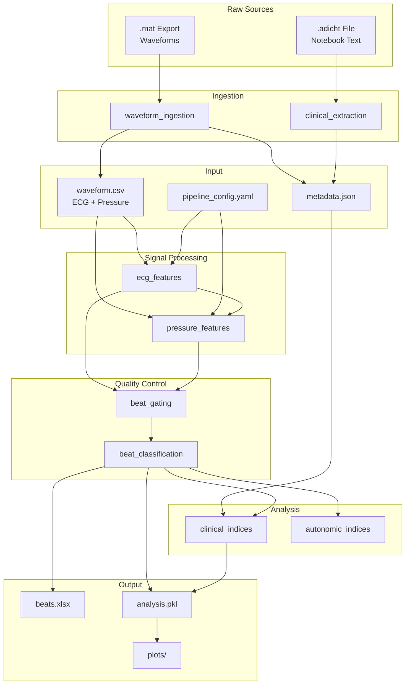

# RHC Pipeline — Architecture

## 1. Overview

This document defines the module structure and data flow for the RHC Variability Analysis pipeline, organised by **signal type** (ECG vs Pressure) and **analysis category** (clinical vs autonomic).

---

## 2. Module Architecture



---

## 3. Output Structure

Each recording is saved to its own directory:

```
output/{recording_id}/
├── waveform.csv         # Raw ingested data
├── metadata.json        # Ingestion metadata + hemodynamics
├── beats.xlsx           # Primary deliverable
├── analysis.pkl         # Full data for reprocessing/plotting
├── intermediates/
│   ├── ecg_features.csv
│   ├── pressure_features.csv
│   └── gated_beats.csv
└── plots/
    ├── ecg_features.png
    ├── pressure_features.png
    ├── beat_gating.png
    └── beat_classification.png
```

---

## 4. Module Responsibilities

| Module | Input | Output | Purpose |
|--------|-------|--------|---------|
| `waveform_ingestion` | `.mat` export | waveform.csv, metadata.json | Extract ECG + Pressure from LabChart |
| `clinical_extraction` | `.adicht` file | metadata.json (hemodynamics) | Extract RA, RV, PA, Wedge, CO from Notebook |
| `ecg_features` | Raw ECG | R-peaks, RR intervals, SQI | ECG preprocessing + timing |
| `pressure_features` | Raw Pressure, R-peaks | Haemodynamic features per beat | Pressure preprocessing + features |
| `beat_gating` | ECG + Pressure features | Validated beat table | Combined quality control |
| `beat_classification` | Validated beats | Classified beats (PA/UNCERTAIN) | Anatomical location classification |
| `clinical_indices` | Classified beats, Metadata | Clinical haemodynamics | mPAP, PVR, PAC calculations |
| `autonomic_indices` | Beat table | Autonomic metrics | HRV, BRS, spectral analysis |

---

## 5. Data Flow Detail

### 5.1 Stage 1: ECG Features
```
Raw ECG Waveform
       ↓
┌─────────────────────────────────────────┐
│ ecg_features                            │
│ • NeuroKit2 ecg_process()               │
│ • R-peak detection                      │
│ • Signal quality index (SQI)            │
│ • RR interval calculation               │
└─────────────────────────────────────────┘
       ↓
ECG Features (r_peaks, rr_intervals, sqi_scores)
```

### 5.2 Stage 2: Pressure Features
```
Raw Pressure Waveform + R-peaks
       ↓
┌─────────────────────────────────────────┐
│ pressure_features                       │
│ • Butterworth low-pass (20 Hz)          │
│ • Systolic peak detection               │
│ • Diastolic trough detection            │
│ • Pulse pressure, dP/dt calculation     │
│ • Mean pressure calculation             │
└─────────────────────────────────────────┘
       ↓
Pressure Features (p_max, p_min_onset, p_min_decay, dp_dt)
```

### 5.3 Stage 3: Beat Gating
```
ECG Features + Pressure Features
       ↓
┌─────────────────────────────────────────┐
│ beat_gating                             │
│ • SQI thresholding                      │
│ • RR physiological limits (30-200 bpm)  │
│ • Arrhythmia detection (20% rule)       │
│ • Slew rate limits (whip detection)     │
│ • Phantom beat detection                │
│ • Jump filter, median filter            │
│ • Chain of Trust assignment             │
└─────────────────────────────────────────┘
       ↓
Validated Beat Table (ecg_status, pressure_status, interval_status)
```

### 5.4 Stage 4: Beat Classification
```
Validated Beats
       ↓
┌─────────────────────────────────────────┐
│ beat_classification                     │
│ • Adaptive active beat check            │
│ • Diastolic threshold check             │
│ • PA-only classification                │
└─────────────────────────────────────────┘
       ↓
Classified Beats (anatomical_loc: PA | UNCERTAIN)
```

### 5.5 Stage 5: Clinical Indices
```
Classified Beats + Metadata JSON
       ↓
┌─────────────────────────────────────────┐
│ clinical_indices                        │
│ • mPAP, sPAP, dPAP (from waveform)      │
│ • PCWP (from metadata)                  │
│ • TPG, DPG, PVR                         │
│ • PAC (compliance)                      │
│ • Beat statistics (mean, SD, CV)        │
└─────────────────────────────────────────┘
       ↓
Clinical Summary
```

---

## 6. Status Code Taxonomy

### 6.1 ECG Status
| Code | Meaning |
|------|---------|
| `VALID` | Passed all ECG checks |
| `NOISE_ECG` | SQI < threshold |
| `ARTIFACT_NOISE` | RR < 300ms (HR > 200) |
| `ARTIFACT_MISSED` | RR > 2000ms (HR < 30) |
| `ECTOPIC_PREMATURE` | RR < 80% of local median |
| `ECTOPIC_PAUSE` | RR > 120% of local median |

### 6.2 Pressure Status
| Code | Meaning |
|------|---------|
| `VALID` | Passed all pressure checks |
| `WHIP_ARTIFACT` | dP/dt exceeds limits (>1500 mmHg/s) |
| `PHANTOM` | dP/dt too low (no coupling) |
| `OUTLIER_JUMP` | Spike in triplet check |
| `OUTLIER_MEDIAN` | Deviation from rolling median |
| `OUTLIER_PHYSIO` | Outside physiological range |

### 6.3 Interval Status
| Code | Meaning |
|------|---------|
| `ACCEPTED` | Valid for all analyses |
| `REJECT_ECG` | ECG failed |
| `REJECT_PRESSURE` | Pressure failed |
| `REJECT_GAP` | Valid beats too far apart |

---

## 7. Configuration Structure

```yaml
# pipeline_config.yaml

ecg_features:
  clean_method: "neurokit"
  sampling_rate: REQUIRED  # Hz

pressure_features:
  lowpass_cutoff_hz: 20.0  # Hz
  lowpass_order: 4
  upstroke_search_start_ms: 120
  upstroke_search_end_ms: 400

beat_gating:
  sqi_threshold: 0.7
  rr_min_ms: 300
  rr_max_ms: 2000
  ectopic_threshold: 0.20
  dp_dt_max_limit: 1500  # mmHg/s
  dp_dt_min_coupling: 50
  jump_threshold_mmhg: 20
  rolling_median_window: 30

beat_classification:
  sys_hard_floor: 25
  sys_tolerance: 0.25
  dia_factor: 0.25
  dia_floor: 8.0

clinical_indices:
  pvr_conversion: 80
  min_beats_required: 30
```

---

## 8. Related Documents

| Document | Description |
|----------|-------------|
| [specs/01_waveform_ingestion.md](./specs/01_waveform_ingestion.md) | Waveform extraction from `.mat` |
| [specs/02_clinical_metadata_extraction.md](./specs/02_clinical_metadata_extraction.md) | Clinical measurement extraction |
| [specs/03_ecg_features.md](./specs/03_ecg_features.md) | ECG preprocessing + RR extraction |
| [specs/04_pressure_features.md](./specs/04_pressure_features.md) | Pressure preprocessing + features |
| [specs/05_beat_gating.md](./specs/05_beat_gating.md) | Combined quality control |
| [specs/06_beat_classification.md](./specs/06_beat_classification.md) | Beat classification (PA-only) |
| [specs/07_clinical_indices.md](./specs/07_clinical_indices.md) | Standard haemodynamic calculations |
