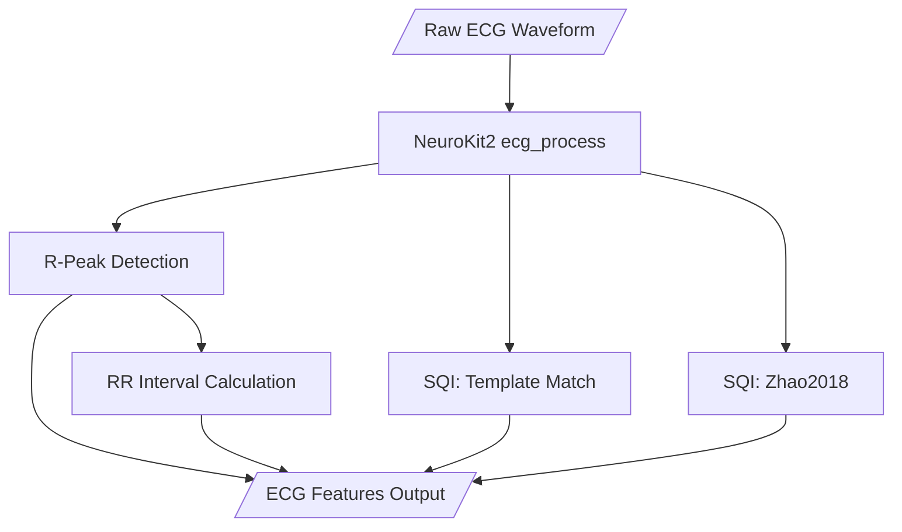

# ECG Features Specification

## 1. Purpose

Process raw ECG signals to extract beat timing information (R-peaks), calculate RR intervals (Raw NN), and assess signal quality for each detected beat.

---

## 2. Processing Flow



---

## 3. Indexing Convention ("Closing Index")

We use the **Closing Index** convention for consistent data lineage:

> **Row $i$ represents the cardiac cycle concluding at R-peak $i$.**

| Concept | Definition | Index Assignment |
| :--- | :--- | :--- |
| **Row Index ($i$)** | The $i$-th R-Peak detected. | $i$ |
| **Closure Event** | R-peak at index $i$. | $i$ |
| **Opening Event** | R-peak at index $i-1$. | $i$ (Stored as `period_start_sample_idx`) |
| **Interval** | Span $Time_{i-1} \to Time_i$. | $i$ |

---

## 4. Processing Steps

### 4.1 Processing Flow

The ECG processing uses **individual NeuroKit2 functions** with configurable methods:

| Step | Function | Config Key | Default |
|------|----------|------------|---------|
| 1 | `nk.ecg_clean()` | `clean_method` | `neurokit` |
| 2 | `nk.ecg_peaks()` | `peak_method` | `neurokit` |
| 3 | `nk.ecg_quality()` | `sqi_method` | `averageQRS` |
| 4 | `nk.ecg_quality()` | — | `zhao2018` (always) |
| 5 | `nk.ecg_delineate()` | `delineate_method` | `dwt` (if enabled) |

#### A. Filtering (`nk.ecg_clean`)
- **High-pass filter**: 0.5 Hz (Butterworth, order 5) to remove respiratory baseline drift.
- **Powerline filter**: 50 Hz.

#### B. R-Peak Detection (`nk.ecg_peaks`)
- **Default Method**: `neurokit` (gradient-based with local maximum refinement)
- **Alternatives**: `kalidas2017`, `promac`, `khamis2016`, `pantompkins1985`, etc.


#### C. Signal Quality Assessment (`nk.ecg_quality`)

**Template Matching (Continuous)**:
- **Code**: `nk.ecg_quality(ecg_cleaned, rpeaks=r_peaks, sampling_rate=fs, method='averageQRS')`
- **Algorithm**: Calculates an average QRS template and correlates each beat to this average.
- **Output**: Score from 0.0 (terrible match) to 1.0 (perfect match).
- **Usage**: Used for micro-filtering (rejecting specific bad beats).

**Zhao et al. (2018) (Categorical)**:
- **Code**: `nk.ecg_quality(ecg_cleaned, rpeaks=r_peaks, sampling_rate=fs, method='zhao2018')`
- **Algorithm**: Uses heuristics (skewness, kurtosis, spectral energy) to validate signal quality.
- **Output**: `'Excellent'`, `'Barely Acceptable'`, or `'Unacceptable'`.
- **Usage**: Segment-level metric. If `'Unacceptable'`, flag for manual review.

### 4.2 RR Interval Calculation

For each beat *i* (where *i > 0*):
```
RR[i] = (r_peak[i] - r_peak[i-1]) / sampling_rate × 1000  # in ms
```

**Handling**:
- The first beat (index 0) has no preceding interval; result is `NaN`.
- The RR interval is aligned to the beat that completes the cycle (the second beat of the pair).

### 4.3 Error Handling

- **Flatline/Disconnect**: If signal variance is near zero, return empty DataFrame. Pre-check signal standard deviation.
- **Short Signals**: If signal is < 10 seconds, log a warning (configurable via `min_duration_sec`).
- **Exception Safety**: Each processing step is wrapped in try-except. On failure, return empty DataFrame and log the error.

---

## 5. Configuration Parameters

| Parameter | Default | Description |
|-----------|---------|-------------|
| `clean_method` | `"neurokit"` | Cleaning algorithm suite |
| `sampling_rate` | **REQUIRED** | ECG sampling rate (Hz) |
| `powerline_freq` | `50` | Powerline frequency (Fixed to 50Hz for UK data) |

> [!IMPORTANT]
> **Correct Sampling Rate is Critical**
> 
> Providing the wrong sampling rate will completely shift the frequency filters and time-domain calculations (HRV, PTT). It must be extracted accurately from the file metadata.

---

## 6. Output Schema

### 6.1 Primary Output (Unified Beat Table)

| Field | Type | Description |
|-------|------|-------------|
| `global_sample_idx` | int | Absolute sample index of the **Closing R-peak** in the original file. Primary Key. |
| `timestamp` | float | Time of the Closing R-peak (s). |
| `period_start_sample_idx` | int | Absolute sample index of the **Opening R-peak** ($i-1$). |
| `sqi_average_qrs` | float | Signal Quality of the Closing Pillar ($i$). |
| `rr_interval` | float | Duration of the interval ($i-1 \to i$) in ms. First row `NaN`. |
| `sqi_zhao_class` | str | Categorical quality of the segment. |

### 6.2 Signals Dictionary (Secondary Output)

The function also returns a `signals` dictionary containing:

| Key | Type | Description |
|-----|------|-------------|
| `ecg_raw` | ndarray | The raw input ECG signal. |
| `ecg_cleaned` | ndarray | The filtered/cleaned ECG signal. |
| `ecg_quality` | ndarray | Continuous quality score (0-1) per sample. |
| `pqrst_features` | DataFrame | (Optional) Full PQRST delineation if `return_pqrst_features=True`. |

---

## 7. References

1. **Makowski, D., et al.** (2021). "NeuroKit2: A Python toolbox for neurophysiological signal processing."
2. **Zhao, Z., & Zhang, Y.** (2018). "SQI quality evaluation mechanism of single-lead ECG signal based on simple heuristic fusion and fuzzy comprehensive evaluation." *Frontiers in Physiology*, 9, 727.
