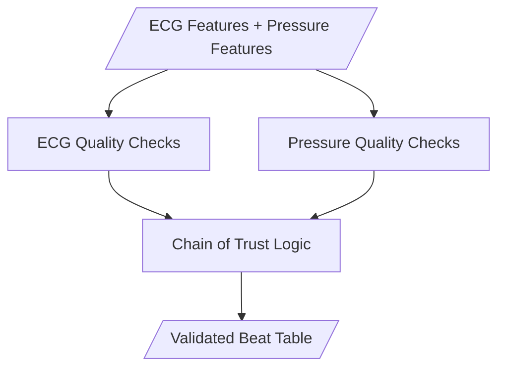

# Beat Gating Specification

## 1. Purpose

Apply quality control checks to each beat using both ECG and pressure features. Assign status codes that determine eligibility for downstream analysis. This module is the **unified gatekeeper**.

---

## 2. Design Philosophy

> [!IMPORTANT]
> **Chain of Trust**
> 
> A beat interval is only `ACCEPTED` for analysis if:
> 1. Current beat passes ALL ECG checks
> 2. Next beat passes ALL ECG checks  
> 3. Current beat passes ALL pressure checks
> 4. Beats are not too far apart (gap check)

---

## 3. Processing Flow



---

## 4. ECG Quality Checks

### 4.1 Signal Quality Thresholds

| Scope | Feature | Condition | Status | Description |
| :--- | :--- | :--- | :--- | :--- |
| **Local** (Beat-by-Beat) | `sqi_average_qrs` | < `sqi_threshold` | `NOISE_ECG` | Catches transient noise/motion artifacts on specific beats. |
| **Global** (Segment) | `sqi_zhao_class` | == 'Unacceptable' | `NOISE_ECG` | Vetoes the entire segment if the overall signal physics are invalid. |

**Defaults**:
*   `sqi_threshold`: 0.7 (`sqi_average_qrs` ranges 0.0-1.0)
*   **Logic**: If Global Check fails, ALL beats in segment are rejected. If Local Check fails, ONLY that beat is rejected.

### 4.2 Kubios Artifact Detection
Uses `neurokit2.signal_fixpeaks` (Kubios method) to identify or correct artifacts. This check runs **after** basic SQI filtering but **before** physiological limits.

**Modes:**
1.  **Flagging (Default)**:
    -   Scans for artifacts using `iterative=False`.
    -   **Action**: Updates beat status with specific codes (`KUBIOS_ECTOPIC`, `KUBIOS_MISSED`, `KUBIOS_EXTRA`) but does **not** change timestamps.
2.  **Correction**:
    -   Corrects artifacts using `iterative=True`.
    -   **Action**: Generates a **new** set of corrected peak locations. Original peaks are preserved for reference.
3.  **Disabled**:
    -   Skips this check.

| Artifact Type | Status Code | Description |
|---------------|-------------|-------------|
| Ectopic | `KUBIOS_ECTOPIC` | Abnormal rhythm detected |
| Missed | `KUBIOS_MISSED` | Beat missed by detector |
| Extra | `KUBIOS_EXTRA` | False positive beat detected |
| Long/Short | `KUBIOS_LONGSHORT` | Misalignment or arrhythmia |

### Detection Logic
Based on *Lipponen & Tarvainen (2019)*. The algorithm uses three "views" of the data (Metrics) and the relationship between neighbors (Geometry) to classify artifacts.

#### 1. Core Mechanics
**The Metrics (Views)**:
-   **$RR$**: Raw interval (seconds).
-   **$dRR$ (Velocity)**: Jump from previous interval ($RR_i - RR_{i-1}$). High velocity $\approx$ Ectopic.
-   **$mRR$ (Trend)**: Deviation from the **11-beat Rolling Median**. Captures local outliers.

**The Geometry (Subspaces)**:
-   **$s_{12}$ (Zig-Zag Check)**: Detects Ectopic beats. If signals zig-zag (Short $\to$ Long), $dRR$ and $s_{12}$ move oppositely.
-   **$s_{22}$ (Two-Step Check)**: Detects Missed/Extra beats. Looks two steps ahead to see if rhythm normalizes.

**Thresholds**: Uses robust $5.2 \times IQR / 2$ limits for difference ($Th_1$) and median deviation ($Th_2$).

#### 2. Diagnostic Criteria (Classification Rules)

**A. Ectopic Beat (`KUBIOS_ECTOPIC`)**
-   **Symptom**: Sudden, erratic jump in rate.
-   **Logic**: The velocity ($dRR$) is too high vs neighbors ($s_{12}$ return map).
-   **Condition**: Outlier in Poincaré map ($S_{12}$ outside acceptance cone).

**B. Missed Beat (`KUBIOS_MISSED`)**
-   **Symptom**: One long interval replacing two normal ones.
-   **Logic**: Interval is $\approx 2 \times$ Median. Rhythm returns to normal immediately (clean $s_{22}$).
-   **Condition**: $|RR_i/2 - Median| < Th_2$.

**C. Extra Beat (`KUBIOS_EXTRA`)**
-   **Symptom**: Two short intervals replacing one normal one.
-   **Logic**: Current + Next interval squares up to $\approx 1 \times$ Median.
-   **Condition**: $|RR_i + RR_{i+1} - Median| < Th_2$.

**D. Long/Short Beat (`KUBIOS_LONGSHORT`)**
-   **Symptom**: "Too fast" or "Too slow" without a clear missed/extra pattern.
-   **Logic**: Simple statistical outlier.
-   **Condition**: $|mRR_i| > 3 \times Th_2$.


### 4.3 Physiological Limits
| Check | Condition | Status |
|-------|-----------|--------|
| Too Fast | RR < 300 ms | `ARTIFACT_NOISE` |
| Too Slow | RR > 2000 ms | `ARTIFACT_MISSED` |

### 4.4 Arrhythmia Detection (20% Rule)

Compare each RR to rolling median (window = 5 beats):

| Check | Condition | Status |
|-------|-----------|--------|
| Premature | RR < 0.80 × median | `ECTOPIC_PREMATURE` |
| Pause | RR > 1.20 × median | `ECTOPIC_PAUSE` |

---

## 5. Pressure Quality Checks

### 5.1 Slew Rate Limits (Whip Detection)
| Check | Condition | Status |
|-------|-----------|--------|
| Positive Whip | dP/dt_max > limit | `WHIP_ARTIFACT` |
| Negative Whip | dP/dt_min < -limit | `WHIP_ARTIFACT` |

**Default**: +1500/-1000 mmHg/s

### 5.2 Mechanical Coupling (Phantom Detection)
| Check | Condition | Status |
|-------|-----------|--------|
| No Coupling | dP/dt_max < minimum | `PHANTOM` |

**Default**: 10 mmHg/s minimum (Lowered to allow RA/Wedge waveforms)

### 5.3 Sudden Jump Filter
Tripplet check for isolated spikes:
```
If (P[i] - P[i-1]) > threshold AND (P[i+1] - P[i]) < -threshold:
    → OUTLIER_JUMP
```

**Default**: 20 mmHg

### 5.4 Rolling Median Filter
Dynamic threshold around local baseline:
```
Threshold = (Median × 0.20) + 4 mmHg
If |p_max - Median| > Threshold → OUTLIER_MEDIAN
```

### 5.5 Physiological Range
| Check | Condition | Status |
|-------|-----------|--------|
| Systolic too high | p_max > 200 | `OUTLIER_PHYSIO` |
| Systolic too low | p_max < 2 | `OUTLIER_PHYSIO` |
| Pulse pressure too low | PP < 2 | `OUTLIER_PHYSIO` |

---

## 6. Chain of Trust Logic ("Closing Index" Aligned)
    
> **Definition**: The interval ending at $i$ is validated by the **Start Pillar** ($i-1$) and the **End Pillar** ($i$).

```python
for i in range(1, n_beats):
    # 1. ECG Trust (Both Pillars must be solid)
    sqi_start_ok = (ecg_status[i-1] in ['VALID', 'CORRECTED'])
    sqi_end_ok   = (ecg_status[i]   in ['VALID', 'CORRECTED'])
    
    # 2. Pressure Trust (The Deck must be clean)
    pres_ok = (pressure_status[i] == 'VALID')
    
    # 3. Geometry Trust (Bridge not too long)
    gap_ok = (rr_interval[i] < 3000) # Hard limit or dynamic check
    
    if sqi_start_ok and sqi_end_ok and pres_ok and gap_ok:
        interval_status[i] = 'ACCEPTED'
    elif not (sqi_start_ok and sqi_end_ok):
        interval_status[i] = 'REJECT_ECG'
    elif not pres_ok:
        interval_status[i] = 'REJECT_PRESSURE'
    else:
        interval_status[i] = 'REJECT_GAP'
```

---

## 7. Configuration Parameters

| Parameter | Default | Description |
|-----------|---------|-------------|
| `sqi_threshold` | `0.7` | Minimum ECG quality |
| `rr_min_ms` | `300` | Minimum RR (ms) |
| `rr_max_ms` | `2000` | Maximum RR (ms) |
| `kubios_mode` | `flagging` | 'flagging', 'correction', 'disabled' |
| `ectopic_threshold` | `0.20` | Arrhythmia sensitivity |
| `median_window` | `5` | Beats for local median |
| `dp_dt_max_limit` | `1500` | Whip detection (mmHg/s) |
| `dp_dt_min_coupling` | `10` | Phantom detection (mmHg/s) |
| `jump_threshold_mmhg` | `20` | Spike detection |
| `rolling_median_pct` | `0.20` | Relative deviation |
| `rolling_median_floor` | `4` | Absolute floor (mmHg) |

---

## 8. Output Schema

| Field | Type | Description |
|-------|------|-------------|
| `global_sample_idx` | int | Absolute sample index of Closing R-peak ($i$). Primary Key. |
| `timestamp` | float | R-peak time (s) of Closing Peak ($i$). |
| `ecg_status` | str | Signal quality of the Closing Peak ($i$). |
| `prev_ecg_status` | str | Signal quality of the Opening Peak ($i-1$). |
| `pressure_status` | str | Pressure quality status for interval $i-1 \to i$. |
| `interval_status` | str | **Final Verdict**. Only analyze if `ACCEPTED`. |

---

## 9. Implementation Reference

See: `src/beat_gating.py`
