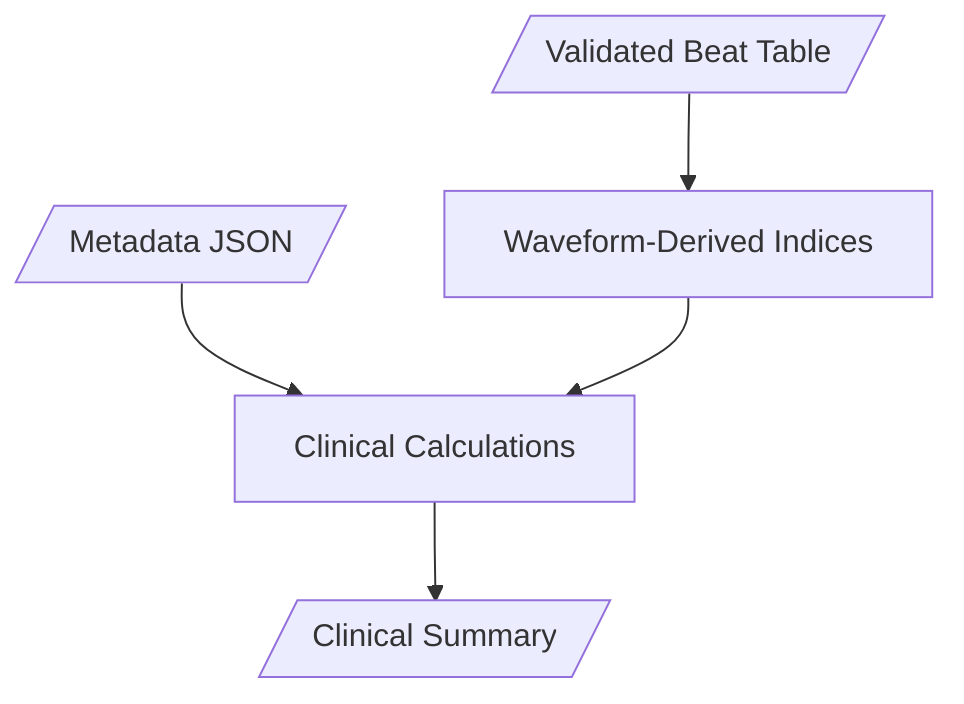

# Clinical Indices Specification

## 1. Purpose

Calculate standard haemodynamic indices from validated beat data and patient metadata.

---

## 2. Processing Flow



---

## 3. Indices Calculated

### 3.1 Waveform-Derived Pressures

**Filters Applied**:
*   `interval_status == 'ACCEPTED'`
*   `anatomical_loc` matching the target chamber.

| Index | Filter (Location) | Formula | Units | Description |
|-------|-------------------|---------|-------|-------------|
| `sPAP` | `PA` | mean(`p_max`) | mmHg | Systolic PA pressure |
| `dPAP` | `PA` | mean(`p_min_decay`) | mmHg | Diastolic PA pressure |
| `mPAP` | `PA` | mean(`p_mean`) | mmHg | Mean PA pressure |
| `PP` | `PA` | mean(`pulse_pressure`) | mmHg | PA Pulse pressure |
| `sRVP` | `RV` | mean(`p_max`) | mmHg | Systolic RV pressure |
| `dRVP` | `RV` | mean(`p_min_onset`) | mmHg | Diastolic RV pressure (EDP) |
| `HR_calc` | `PA`/`RV` | 60000 / mean(`rr_interval_ms`) | bpm | Heart Rate from waveform |

### 3.2 Pressure Statistics

| Index | Formula | Units | Description |
|-------|---------|-------|-------------|
| `sPAP_SD` | std(p_max) | mmHg | Systolic variability |
| `sPAP_CV` | std/mean × 100 | % | Coefficient of variation |
| `dPAP_SD` | std(p_min_decay) | mmHg | Diastolic variability |
| `PP_SD` | std(pulse_pressure) | mmHg | Pulse pressure variability |

### 3.3 Metadata-Derived Values (Reference)

All values in this section are extracted from patient metadata JSON (`hemodynamics` section) and use the `_ref` suffix to distinguish them from waveform-derived values.

**Right Atrium (RA)**

| Index | Source | Units |
|-------|--------|-------|
| `sRAP_ref` | hemodynamics.RA.systolic | mmHg |
| `dRAP_ref` | hemodynamics.RA.diastolic | mmHg |
| `mRAP_ref` | hemodynamics.RA.mean | mmHg |

**Right Ventricle (RV)**

| Index | Source | Units |
|-------|--------|-------|
| `sRVP_ref` | hemodynamics.RV.systolic | mmHg |
| `dRVP_ref` | hemodynamics.RV.diastolic | mmHg |
| `mRVP_ref` | hemodynamics.RV.mean | mmHg |

**Pulmonary Artery (PA)**

| Index | Source | Units |
|-------|--------|-------|
| `sPAP_ref` | hemodynamics.PA.systolic | mmHg |
| `dPAP_ref` | hemodynamics.PA.diastolic | mmHg |
| `mPAP_ref` | hemodynamics.PA.mean | mmHg |

**Wedge / PCWP**

| Index | Source | Units |
|-------|--------|-------|
| `sPCWP_ref` | hemodynamics.Wedge.systolic | mmHg |
| `dPCWP_ref` | hemodynamics.Wedge.diastolic | mmHg |
| `mPCWP_ref` | hemodynamics.Wedge.mean | mmHg |

**Cardiac Output**

| Index | Source | Units |
|-------|--------|-------|
| `CO_ref` | mean(hemodynamics.CO) | L/min |
| `HR_ref` | hemodynamics.HR | bpm |
| `SV_ref` | CO_ref / HR_ref × 1000 | mL |
| `SV_calc` | CO_ref / HR_calc × 1000 | mL |

### 3.4 Calculated Gradients and Resistances

| Index | Formula | Units | Description |
|-------|---------|-------|-------------|
| `TPG` | mPAP - mPCWP_ref | mmHg | Transpulmonary gradient |
| `DPG` | dPAP - mPCWP_ref | mmHg | Diastolic pressure gradient |
| `PVR` | (mPAP - mPCWP_ref) / CO_ref × 80 | dyn·s·cm⁻⁵ | Pulmonary vascular resistance |
| `PVR_WU` | (mPAP - mPCWP_ref) / CO_ref | Wood units | PVR in Wood units |

### 3.5 Pulmonary Arterial Compliance

We calculate two sets of indices: one using the **Reference HR** (from metadata) and one using the **Calculated HR** (from waveform).

| Index | Formula | Units | Description |
|-------|---------|-------|-------------|
| `PAC_ref` | SV_ref / PP | mL/mmHg | Compliance (using Ref HR) |
| `RC_time_ref` | PVR × PAC_ref × 60 | ms | RC time constant (using Ref HR) |
| `PAC_calc` | SV_calc / PP | mL/mmHg | Compliance (using Calc HR) |
| `RC_time_calc` | PVR × PAC_calc × 60 | ms | RC time constant (using Calc HR) |

Where:
*   `SV_ref = CO_ref / HR_ref × 1000`
*   `SV_calc = CO_ref / HR_calc × 1000`


---

## 4. Configuration Parameters

| Parameter | Default | Description |
|-----------|---------|-------------|
| `pvr_conversion` | `80` | Conversion factor to dyn·s·cm⁻⁵ |
| `min_beats_required` | `30` | Minimum beats for valid calculation |

---

## 5. Output Schema

```json
{
  "waveform": {
    "sPAP": 45.2,
    "dPAP": 18.5,
    "mPAP": 28.1,
    "PP": 26.7,
    "sRVP": 40.0,
    "dRVP": 8.0,
    "n_PA": 244,
    "n_RV": 28
  },
  "variability": {
    "sPAP_SD": 3.2,
    "sPAP_CV": 7.1,
    "dPAP_SD": 2.1,
    "PP_SD": 2.8
  },
  "derived": {
    "TPG": 12.1,
    "DPG": 2.5,
    "PVR": 192,
    "PVR_WU": 2.4,
    "PAC": 2.1,
    "RC_time": 403
  },
  "reference": {
    "sRAP_ref": 9, "dRAP_ref": 3, "mRAP_ref": 6,
    "sRVP_ref": 71, "dRVP_ref": 1, "mRVP_ref": 25,
    "sPAP_ref": 71, "dPAP_ref": 23, "mPAP_ref": 42,
    "sPCWP_ref": 12, "dPCWP_ref": 8, "mPCWP_ref": 10,
    "CO_ref": 5.4, "HR_ref": 75, "SV_ref": 72
  },
  "quality": {
    "n_beats_total": 450,
    "n_beats_valid": 412,
    "pct_valid": 91.6
  }
}
```

---

## 6. Implementation Reference

See: `src/clinical_indices.py`
